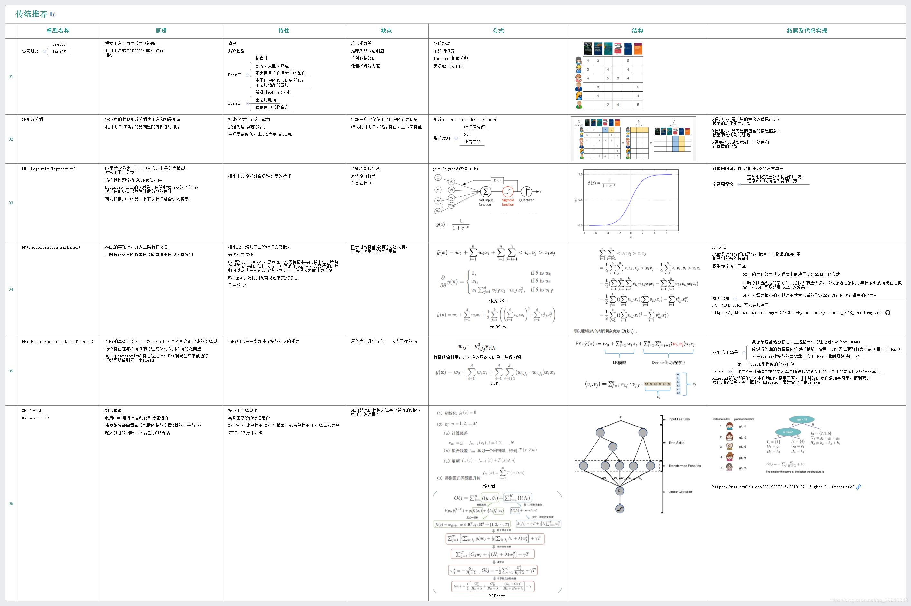

# Spapk_based_recommendation_algorithm

传统的推荐算法

### 在基于Spark的音乐推荐系统中，你可以使用以下算法或技术：

    1.协同过滤（Collaborative Filtering）：协同过滤是一种常用的推荐算法，通过分析用户的历史行为和其他用户的行为模式，来预测用户可能感兴趣的音乐。在Spark中，你可以使用基于矩阵分解的协同过滤算法，如交替最小二乘法（Alternating Least Squares，ALS）。
    
    2.基于内容的推荐（Content-based Recommendation）：基于内容的推荐算法根据音乐的特征和用户的偏好，推荐与用户兴趣相似的音乐。你可以使用Spark提供的机器学习库，如MLlib，来构建和训练基于内容的推荐模型。
    
    3.混合推荐（Hybrid Recommendation）：混合推荐算法结合了多个推荐算法的优点，以提高推荐的准确性和多样性。你可以将协同过滤和基于内容的推荐算法进行结合，或者将其他推荐算法与之组合，以实现更好的推荐效果。
    
    4.基于隐语义模型（Latent Factor Models）：隐语义模型通过将用户和音乐映射到一个低维的隐空间，来捕捉用户和音乐之间的关联关系。你可以使用基于隐语义模型的算法，如奇异值分解（Singular Value Decomposition，SVD）或隐语义索引（Latent Semantic Indexing，LSI），来进行音乐推荐。
    
    5.深度学习模型：深度学习在音乐推荐领域也有广泛的应用。你可以使用Spark的Deep Learning Pipelines库来构建和训练深度学习模型，如基于神经网络的推荐模型，以实现更准确的音乐推荐。
    
    以上算法只是一些常用的选择，实际上还有很多其他的推荐算法可以尝试。具体选择哪种算法要根据你的数据特点、业务需求和性能要求进行综合考虑。

### 均方根误差

    均方根误差（Root Mean Squared Error，RMSE）是衡量预测模型在实际观测值与预测值之间的误差的常用指标之一。它计算了预测值与实际观测值之间的差异，并对差异进行平方、求平均并开方的操作，以获得误差的平均量级。
    RMSE 的计算步骤如下：
    
    对于每个样本，计算预测值与实际观测值之间的差异（误差）。
    对所有样本的误差进行平方。
    求所有样本的误差平方的平均值。
    对平均误差进行开方，得到均方根误差。
    数学表达式如下：
    
    RMSE = sqrt( (1/n) * Σ(y_pred - y_actual)^2 )
    
    其中，RMSE 是均方根误差，n 是样本数量，y_pred 是预测值，y_actual 是实际观测值，Σ 表示求和操作。
    
    RMSE 的值越小，表示预测模型的精度越高，预测结果与实际观测值的差异越小。这使得 RMSE 成为评估回归模型性能的常见指标之一。